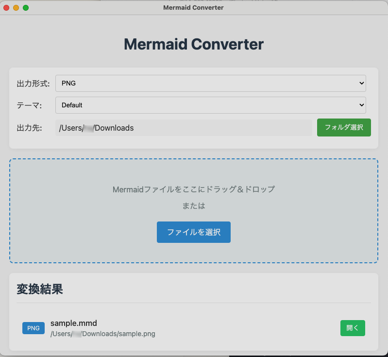

# Mermaid Converter App

Mermaid Converter App is a cross-platform desktop application that allows you to convert Mermaid.js diagrams into PDF, PNG, and SVG formats. Built with Electron, this app supports drag & drop functionality for seamless conversions.

## 🚀 Features
- Convert **Mermaid.js diagrams** to **PDF, PNG, SVG**
- **Drag & Drop** support for easy file selection
- **Cross-platform** (Windows & macOS)
- Simple and lightweight UI

---

## 🖼️ Application Screenshot



---

## 📥 Install & Build

Mermaid Converter App does not provide pre-built binaries.  
Please build it from the source code using the following steps.

### **1. Clone the repository & install dependencies**
```sh
git clone https://github.com/wataryoichi/mermaid-converter-app.git
cd mermaid-converter-app
npm install
```

### **2. Run the app (development mode)**
```sh
npm start
```

### **3. Build for production**
- **For macOS:**
  ```sh
  npm run build:mac
  ```
- **For Windows:**
  ```sh
  npm run build:win
  ```
- **For both platforms:**
  ```sh
  npm run build
  ```

The built application will be available in the `dist/` folder.

---

## 🛠 How to Use

### **Usage**
1. **Drag & Drop** your Mermaid.js `.mmd` file into the app.
2. Select the desired output format (**PDF, PNG, SVG**).
3. Click **Convert** and save the file to your desired location.

---

## 📜 License
This project is licensed under the **MIT License**. See the [LICENSE](./LICENSE) file for details.

---

## 🤝 Contributing
Pull requests are welcome! If you find any issues or have suggestions, feel free to open an [issue](https://github.com/wataryoichi/mermaid-converter-app/issues).

---

## 📧 Contact
For inquiries or feedback, reach out via GitHub issues.

---

## 🙏 Acknowledgements

- [Electron](https://www.electronjs.org/) - Cross-platform desktop application framework
- [Mermaid](https://mermaid.js.org/) - JavaScript based diagramming and charting tool
- [mermaid-cli](https://github.com/mermaid-js/mermaid-cli) - Command-line interface for Mermaid

---

### ✅ Enjoy using Mermaid Converter App! 🎉
